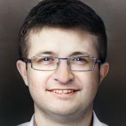
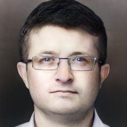

<!--

SPDX-FileCopyrightText: Copyright (c) 2023-2024, Idiap Research Institute. All rights reserved.
SPDX-License-Identifier: LicenseRef-IdiapNCResearchAndEducationalOnly

-->
_synthetics_ - Synthetic face image generation, inversion, editing and database generation
------------------------------------------------------------------------------------

This package provides various tools for working with synthetic and genuine 
biometric face images. In particular it provides APIs and CLI tools for:

- Generation of synthetic face images via StyleGAN2/3 and EG3D
- Latent editing using precomputed latent directions
- Projection of a face image or face dataset into latent space
- Computation of semantic editing latent directions from those
- Generation of a synthetic dataset with several algorithms

All the code is written using PyTorch and most algorithms can 
be run seamlessly on GPU. Most of the API supports batching in
order to get the best performances from the computing device. In addition, a 
number utility functions for saving, loading and plotting data are provided.

If you use this package and/or its results, please consider citing 
the papers listed at the end of this file.

### Model dependencies

This software package relies on several preexisting pre-trained models:

- **StyleGAN2**
  * https://arxiv.org/abs/1912.04958 
  * https://github.com/NVlabs/stylegan2
- **StyleGAN3**
  * https://arxiv.org/abs/2106.12423
  * https://github.com/NVlabs/stylegan3
- **EG3D**
  * https://arxiv.org/abs/2112.07945
  * https://github.com/NVlabs/eg3d
- **DLIB Face Landmark detector**
  * http://dlib.net/face_landmark_detection.py.html
- **VGG16**
  * https://arxiv.org/abs/1801.03924
- **IResNet / Arcface face recognition models**
  * https://www.idiap.ch/software/bob/
- **Adaface IResNet models**
  * https://arxiv.org/abs/2204.00964
  * https://github.com/mk-minchul/AdaFace
- **Deep3DFaceRecon pytorch**
  * https://github.com/sicxu/Deep3DFaceRecon_pytorch
- **Basel Face Model**
  * https://faces.dmi.unibas.ch/bfm/index.php?nav=1-1-0&id=details

The models are downloaded automatically on first use, except for the 
Basel Face Model which can be obtained after filling a form.

### License

This package is released under the MIT license, a copy is provided in this repository. While this software itself is released under the MIT license, it is based on non-commercial libraries which cannot be used in a commercial scenario and need to be removed in such a case.


Installation
------------

To install this package, first download this repository. Then:

1) Install ```miniforge3```  or 
compatible, if not already present on your system:

```bash
curl -L -O "https://github.com/conda-forge/miniforge/releases/latest/download/Miniforge3-$(uname)-$(uname -m).sh"
bash Miniforge3-$(uname)-$(uname -m).sh
```

2) Install ```mamba```in the root environment and create the environment:

```bash
conda install mamba
mamba env create -f environment.yml 
```

3) Install the package in development mode

```bash
conda activate synthetics
pip install -e .
```

4) For some experiments, it might be necessary to install ```nvdiffrast``` 

```bash
cd synthetics/nvdiffrast
pip install .
```

### Environment variables

The compiler needs to have access to the CUDA toolkit headers for StyleGAN torch plugin 
compilation, on some installations it might be necessary to export this path manually:

```bash
export CUDA_HOME=/usr/local/cuda-12.2/
```

In case problems arise while building plugins, it might be necessary to purge 
the pytorch extension folder:

```bash
cd
rm -r .cache/torch_extensions/*
```

### Configuration file 

This package uses a YAML configuration file to store paths and URLs to the various 
models and databases. The code first looks for a hidden dot-file in the user's 
repository ```~/.synthetics.yml``` and, if not found, for for a the file 
```./synthetics.yml``` in the current directory .
It is necessary to copy ```synthetics.yml``` the to edit to the user's home directory
```bash
cp synthetics.yml ~/.synthetics.yml
```
and edit the relevant data in the copied file.

It's important to setup the absolute path of the repository ```source```, a path where 
to store downloaded models ```models``` and a path for data. To do this, replace by hand
the placeholders, staring with the dollar sign, by your preferred paths.

```yaml
config:
  source: $synthetics_git_path
  models: $user_models_cache_path
  latent_directions: $data_path/latent_directions/
  databases:
    user_index_directory: $data_path/databases_index
    local_index_repository: $databases_index_path/databases_index
    multipie:
      data_path: $databases_path/Multi-Pie/data/
    ffhq:
      data_path: $databases_path/Flickr-Faces-HQ/
  bfm_folder: $user_models_cache_path/BFM/
```

Then create the directories if they do not exist yet:

```bash
mkdir $user_models_cache_path
mkdir $data_path
mkdir $data_dir
```

The rest of the file contain URLs and local paths for the different models and can be left as is.

Usage
-----

The code provide a CLI interface and a python API for most functionalities. 
To have a list of CLI commands, type:

```bash
synthetics --help
```

To get help for a specific command:

```bash
synthetics <command> --help
```

### Generate an image from a random latent

To generate a image from a random latent vector, use the CLI command:

```bash
synthetics generate --network-type eg3d --fov 20.0 --pitch -20.0 --yaw 10.0 --out image.jpg --save-depth
```

It can also be done via the Python API, it's important to first select a 
device (only ```cuda``` will work for most generators) and a ```network_type```:

```python
import torch
from synthetics import Generator, utils

# Setup the generator
device = torch.device('cuda')
network_type = 'stylegan2'
generator = Generator(device=device, network_type=network_type)

# Generate z and w latents
z = torch.randn((1,generator.z_dim), device=device)
w = generator.mapping(z)

# Generate image and save it
image = generator.synthesis(w=w)
utils.save_image(image=image, file_path='./image.jpg')
```

For the EG3D generator it is necessary to generate a camera vector:

```python
import torch
from synthetics import Generator, utils

# Setup the generator
device = torch.device('cuda')
generator = Generator(device=torch.device('cuda'), network_type='eg3d')

# Generate z, w latents and camera
z = torch.randn((1,generator.z_dim), device=device)
c = generator.camera(fov_deg=20.0, pitch_deg=-20.0, yaw_deg=10.0)
w = generator.mapping(z, c, truncation_psi=0.7)

# Generate and save images
image = generator.synthesis(w=w, c=c)
depth_map = generator.get_depth_map()
utils.save_image(image=image, file_path='./image.jpg')
utils.save_image(image=depth_map, file_path='./depth.jpg')
```

### Save and load latent vectors

It is possible to store and load latent vectors in a HDF5 sample file

```python
import torch
from synthetics import Generator
from synthetics import Sample

# Setup the generator and generate z, w latents
network_type = 'stylegan2'
device = torch.device('cuda')
generator = Generator(device=torch.device('cuda'), network_type=network_type)
z = torch.randn((1,generator.z_dim), device=device)
w = generator.mapping(z)

# Save sample
sample = Sample(z_latent=z, w_latent=w, network_type=network_type)
sample.save(file_path='sample.h5')

# Load sample
sample = Sample()
sample.load(file_path='sample.h5', device=device)
assert(sample.w_latent.shape == w.shape)
```

To generate an image from a sample file one can use the following command:

```bash
synthetics generate --input sample.h5 --out image.jpg 
```

For large numbers of samples, it is possible to store many samples in a single HDF5 file using the ```SampleCollection``` class

```python
import torch
from synthetics import Generator, Sample, SampleCollection

# Generate latents
num_latents = 1000
network_type = 'stylegan2'
device = torch.device('cuda')
generator = Generator(device=torch.device('cuda'), network_type=network_type)
z = torch.randn((num_latents, generator.z_dim), device=device)
w = generator.mapping(z)

# Save sample collection
sample_collection = SampleCollection(file_path='collection.h5', read_only=False)
for i in range(num_latents):
    sample = Sample(w_latent=w[i].unsqueeze(0), network_type=network_type)
    sample_collection.add_sample(identity=i, label='label', sample=sample)
sample_collection.save()
```

### Face alignment and cropping

Some models, such as embedding extractors, require face images to be of a certain size 
with the face properly aligned in the image. Several algorithms are available in the 
```Cropper``` module. The algorithm is chosen automatically from a pair of input and output
presets which are available via the ```Cropper.Config``` enum.

```python
import torch
from synthetics import Cropper, utils

# Load images, the first one is not aligned, the second is already aligned as FFHQ
device=torch.device('cuda')
input_1_wild = utils.load_image(file_path='image_wild.png', device=device)
input_2_ffhq = utils.load_image(file_path='image_ffhq.png', device=device)

# Instantiate croppers and crop images
cropper_wild = Cropper(
    input_config=Cropper.Config.mtcnn, 
    output_config=Cropper.Config.arcface, 
    device=device)
cropper_fixed = Cropper(
    input_config=Cropper.Config.ffhq, 
    output_config=Cropper.Config.arcface, 
    device=device)
output_1_arcface = cropper_wild.crop(image=input_1_wild)
output_2_arcface = cropper_fixed.crop(image=input_2_ffhq)
assert(output_1_arcface.shape == output_2_arcface)
```

The corresponding CLI commands are as follow:

```bash
synthetics crop -i image_wild.png -c ffhq -o output_1_arcface.jpg -t arcface 
synthetics crop -i input_ffhq.png -c ffhq -o output_2_arcface.jpg -t arcface 
```

Face landmarks detection is provided via the ```LandmarkDetector``` class which wraps MTCNN, 
DLIB and kornia backends. 3D landmarks pose estimation can be achieved via the ```FaceExtractor3D```
class wrapping the 3DFaceRecon-pytorch package as well as EG3D utilities.

### Genuine face databases

This package has simple biometric sample database engine used to access images and metadata 
of some common face databases. This engine relies on SQLite index files that contain the path
of every sample in the original file database. The database should be obtained separately.

```python 
from synthetics import Database, FFHQDatabase

# Instantiate and query all samples
ffhq_database = FFHQDatabase()
samples : Database.Sample = ffhq_database.query(protocol_names=None, group_names=None)

# Load all samples in a single tensor
samples_data = [ffhq_database.load_sample(sample) for sample in samples]
samples_data = torch.tensor(samples_data)
```

### Face recognition and embedding extraction

A wrapper around several FR models is provided for convenience, allowing to extract 
an face embedding from an aligned face image. This module also provide a distance function 
that compute the angle between two embeddings

```python
import torch
from synthetics import Cropper, Embedding, utils

device=torch.device('cuda')
image_alice = utils.load_image(file_path='alice.png', device=device)
image_bob = utils.load_image(file_path='bob.png', device=device)

# Instantiate a cropper and an embedding extractor
cropper = Cropper(
    input_config=Cropper.Config.mtcnn, 
    output_config=Cropper.Config.arcface, 
    device=device)
embedding = Embedding(
    model_name='adaface_r50_webface4m',
    device=device)

# Crop, extract embedding and compute distance
crop_alice = cropper.crop(image_alice)
crop_alice = cropper.crop(image_bob)
e_alice = embedding.extract(crop_alice)
e_bob = embedding.extract(crop_bob)
print(embedding.distance(e_alice, e_bob))
```

It is also possible to extract an embedding from an image and save it to a sample file via the command line:

```bash
synthetics \
  get-embedding \
    --model adaface_r50_webface4m \
    --input image.png \
    --out sample.h5
```

### Latent projection and editing

Functionality to project a face image into the latent space of given GAN is provided via the ```Projector``` class.
This code is adapted from the excellent repository https://github.com/tocantrell/stylegan3-fun-pipeline.
To project a face image, use the following command:

```bash
synthetics \
    project \
        --network-type stylegan2 \
        --target image.png \
        --crop \
        --outdir out \
        --save-video
```

A variety of parameters are provided by both the command line interface and the python API.

A pytorch implementation of the latent editing technique introduced in Colbois_IJCB_2021 is 
provided via the ```LatentEdit``` class. This functionality uses latent directions vectors, or *covariates*,
that come from a linear SVM fitted on the projections of the MultiPIE database samples. 
The latent direction file is downloaded automatically on first use. Following is an example 
of the CLI commands to project and edit images:

```bash
mkdir out
synthetics project -t synthetics/test/data/seb.png -o out/
synthetics latent-edit -i out/00000-projection-w-wavgstart/projected_wavg_final.h5 -o out/seb_happy.h5 -n -e smile
synthetics latent-edit -i out/00000-projection-w-wavgstart/projected_wavg_final.h5 -o out/seb_not_happy.h5 -n -e smile -s -2.0
synthetics generate -i out/seb_happy.h5 -o out/seb_happy.jpg
synthetics generate -i out/seb_not_happy.h5 -o out/seb_not_happy.jpg  
```

   

While computationally **very expensive**, scripts to regenerate these vectors are provided in this package.
First one should make sure that the MultiPIE database is available path and is configured correctly in the 
package's config file. Then the sample should be projected individually, preferably in a parallel job (TODO slurm)

```bash
#$ -S /usr/bin/zsh
#$ -t 1-8:1

export PATH=$MINIFORGE3_PATH/bin:$PATH
export PYTHONUNBUFFERED=1
export CUDA_HOME=/usr/local/cuda-12.2/
source activate synthetics

synthetics project-database \
    --database multipie \
    --output-dir $DATA_DIR/multipie_projection \
    --network-type stylegan2-256 \
    --num_steps 1000 \
    --checkpoint
```

Alternatively, the projected samples can be found in the separate data repository.

When the projected samples are ready the linear SVM fitting can be launched 

```bash
synthetics latent-analysis \
    --projections-dir $DATA_DIR/multipie_projection \
    --output-path $DATA_DIR/latent_directions
```

In order to be used for latent editing, the resulting file should be copied to the 
latent direction directory set in the config file.


### Synthetic databases generation

With all the tools at hand, it is now possible to generate synthetic databases. As of this version, this process
is divided in two parts:

1) Generation of the reference identities (inter-class)
2) Generation of identities variations (intra-class)

Several algorithm are available for both steps, we focus here only on the *Langevin* algorithm for references
and *Dispersion* and *DisCo* for variations. We refer the user to the article [geissbuhler2024synthetic] for
a detailed description of the algorithms and their respective parameters.

To create the 10k references, with a StyleGAN2 generator and a simple iresnet FR model, the following batch job can be used

```bash
#$ -S /usr/bin/zsh

export PATH=$MINIFORGE3_PATH/bin:$PATH
export PYTHONUNBUFFERED=1
export CUDA_HOME=/usr/local/cuda-12.2/
source activate synthetics

synthetics \
    generate-database \
        --network-type stylegan2-256 \
        --embedding-type iresnet50 \
        --num-identities 10000 \
        --batch-size 64 \
        --disable-progress-bar \
        --postprocessor-config arcface \
        --root-directory $synthetic_databases/sg2_n10k_ir50_r14_lang \
    create-references \
        --algorithm langevin \
        --ict 1.4 \
        --langevin-iterations 100 \
        --langevin-repulsion-coefficient 1.0 \
        --langevin-repulsion-radius 1.4 \
        --langevin-timestep -0.3 \
        --langevin-viscous-coefficient 1.0 \
        --langevin-random-force 0.01 \
        --langevin-latent-force 0.1 \
        --langevin-checkpoint-iter 10
```

**TODO fix radius**

This command will sample randomly 10k latent vectors, and improve iteratively their distribution with respect to the 
reference *iresnet50* FR model. At the end the latent vectors and embeddings are saved in a ```samples.h5``` sample
collection file, and images cropped according to the *arcface* format are saved in a subfolder. In addition a
*stats.h5* file storing different dynamical quantities is saved as well. As of this version, *Langevin* jobs 
cannot be run in parallel. In addition, a YAML file containing all the command line parameter is also saved.

Once references are created, variations can be created via the *Dispersion* algorithm, which can be run in parallel:

```bash
#$ -S /usr/bin/zsh
#$ -t 1-8:1

export PATH=$MINIFORGE3_PATH/bin:$PATH
export PYTHONUNBUFFERED=1
export CUDA_HOME=/usr/local/cuda-12.2/
source activate synthetics

synthetics \
    generate-database \
        --network-type stylegan2-256 \
        --embedding-type iresnet50 \
        --num-identities 10000 \
        --batch-size 64 \
        --disable-progress-bar \
        --postprocessor-config arcface \
        --root-directory $synthetic_databases/sg2_n10k_ir50_r14_disp_n64 \
    create-variations \
        --algorithm dispersion \
        --dispersion-iterations 20 \
        --dispersion-num-augmentations 64 \
        --dispersion-embedding-coefficient 20.0 \
        --dispersion-latent-coefficient 1.0 \
        --dispersion-latent-radius 12.0 \
        --dispersion-latent-global-coefficient 1.0 \
        --dispersion-random-force 0.05 \
        --dispersion-viscous-coefficient 1.0 \
        --dispersion-timestep 0.05 \
        --dispersion-initial-noise 0.2 \
        --identities-references $synthetic_databases/sg2_n10k_ir50_r14_dc06_lang/samples.h5
```

Here, 64 variations per identities are created with 20 iterations of the algorithm. Since the 
job has ran in parallel, it is desirable to merge the samples collections and stats files 
in single files:

```bash
#$ -S /usr/bin/zsh

export PATH=$MINIFORGE3_PATH/bin:$PATH
export PYTHONUNBUFFERED=1
export CUDA_HOME=/usr/local/cuda-12.2/
source activate synthetics

synthetics \
  generate-database \
        --network-type stylegan2-256 \
        --embedding-type iresnet50 \
        --num-identities 10000 \
        --batch-size 64 \
        --root-directory $synthetic_databases/sg2_n10k_ir50_r14_disp_n64 \
    merge-samples \
        --references-collection $synthetic_databases/sg2_n10k_ir50_r14_dc06_lang/samples.h5 \
        --remove \
    merge-stats \
        --remove
```

### Plotting

It is possible to plot distance histograms with the CLI ```plot```command:

```bash
synthetics \
    plot \
        load-sample-collection \
            --collection-name dispersion \
            --file-path $synthetic_databases/sg2_n10k_ir50_r14_disp_n64/samples.h5 \
        compute-histogram \
            --histogram-name inter_emb \
            --data-type embedding \
            --class-type inter \
            --collection-name dispersion \
            --export $synthetic_databases/sg2_n10k_ir50_r14_disp_n64/embeddings_inter_class.dat
        compute-histogram \
            --histogram-name intra_emb \
            --data-type embedding \
            --class-type intra \
            --collection-name dispersion \
            --export $synthetic_databases/sg2_n10k_ir50_r14_disp_n64/embeddings_intra_class.dat
```


Papers
------

Please cite the following paper(s):

    @article{geissbuhler2024synthetic,
      title={Synthetic Face Datasets Generation via Latent Space Exploration from Brownian Identity Diffusion},
      author={Geissb{\"u}hler, David and Shahreza, Hatef Otroshi and Marcel, S{\'e}bastien},
      journal={arXiv preprint arXiv:2405.00228},
      year={2024}
    }

    @INPROCEEDINGS{Colbois_IJCB_2021,
        author = {Colbois, Laurent and de Freitas Pereira, Tiago and Marcel, S{\'{e}}bastien},
        projects = {Idiap, Biometrics Center},
        title = {On the use of automatically generated synthetic image datasets for benchmarking face recognition},
        booktitle = {International Joint Conference on Biometrics (IJCB 2021)},
        year = {2021},
        note = {Accepted for Publication in IJCB2021},
        pdf = {http://publications.idiap.ch/downloads/papers/2021/Colbois_IJCB_2021.pdf}
    }


